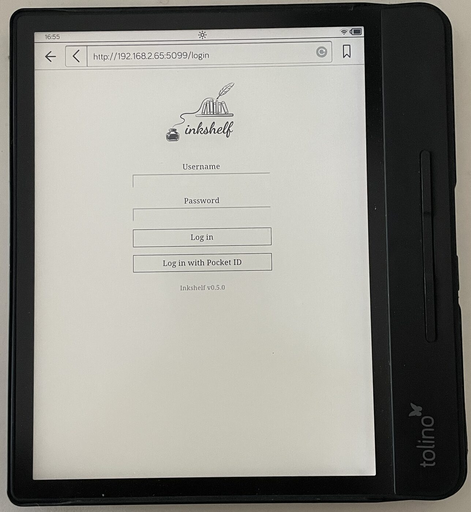

<p align="center">
  <picture>
    <source media="(prefers-color-scheme: dark)" srcset="src/Inkshelf/wwwroot/img/logo-inverted.png">
    
  </picture>
</p>

<p align="center">
  A lightweight, server-rendered web client for <a href="https://www.audiobookshelf.org/">Audiobookshelf</a>, built for e-reader browsers.
</p>

<p align="center">
  <a href="LICENSE"></a>
  
  
</p>

---

Audiobookshelf's own web UI leans heavily on JavaScript, which older e-ink
reader browsers can't run — you log in and then nothing really happens. **Inkshelf**
is a thin companion that renders plain HTML on the server with near-zero client
JavaScript, so browsing your library works on those low-powered browsers.

It runs as a **sidecar container** next to your Audiobookshelf instance, talks to
the ABS API on your behalf, and keeps no database of its own — your ABS session
token lives in an encrypted cookie. Pages are built from `<form>` and `<a>`
elements only.

> **Note:** Inkshelf was built using agentic software engineering (AI-assisted
> coding) and reviewed by a human. See the git history for details.

## Screenshots

<p align="center">
  <a href="docs/img/login.jpg"></a>
</p>

<p align="center"><sub>Inkshelf on a real e-ink reader. <strong><a href="docs/SCREENSHOTS.md">See more screenshots →</a></strong></sub></p>

## Features

- **Browse & find** — libraries list, paginated item view with covers, full-text
  search, author/series filters, cycling sort links (title / author / added /
  sequence), and a one-tap favorite library that you land on by default.
- **Read** — download the original ebook, or convert CBZ/CBR comics on demand to
  a **device-sized, fixed-layout EPUB** (epubcheck-clean). Conversions are cached
  on disk and the listing shows which items are already converted.
- **Optional SSO** — if your ABS server uses an OIDC provider, Inkshelf can offer
  the same login, so nobody needs a second password. No client secret of its own;
  see [SSO / OIDC login](#sso--oidc-login-optional).
- **Stateless & private** — your ABS token is held in a Data-Protection-encrypted,
  HttpOnly cookie and refreshed transparently when it expires. No accounts, no
  database.
- **Built for weak browsers** — near-zero JavaScript, defensive CSS, plain HTML
  forms and links so it works on older e-ink browser engines.
- **Hardened & bounded** — force-secure cookies behind a proxy, optional
  trusted-proxy scoping, a bounded/sanitized/gateable diagnostics endpoint, and
  resource-exhaustion guards on conversion and the cache.
- **Easy to run** — a single multi-arch (`linux/amd64` + `linux/arm64`) container
  image; no external services beyond your ABS server.

## Deployment

Inkshelf is designed to run as a **sidecar next to Audiobookshelf**, on the same
private network, behind whatever **reverse proxy** already terminates TLS for your
setup. It speaks plain HTTP on port **8080**; your proxy handles HTTPS.

### Quick start (Docker)

```bash
docker run -d --name inkshelf -p 8080:8080 \
  -e ABS_URL=http://your-abs-host:13378 \
  -v inkshelf-keys:/keys -e DataProtectionKeysPath=/keys \
  -v inkshelf-cache:/cache -e CachePath=/cache \
  ghcr.io/thomaslazar/inkshelf:latest
```

Open `http://localhost:8080` and log in with your Audiobookshelf credentials.

### Docker Compose (recommended)

Copy [`docker-compose.example.yml`](docker-compose.example.yml), point `ABS_URL`
at your ABS service, and bring it up:

```bash
docker compose -f docker-compose.example.yml up -d
```

It pulls the published image, exposes port 8080, and persists the Data-Protection
keys and the EPUB cache in named volumes so logins and conversions survive
restarts. To build from source instead, replace the `image:` line with `build: .`.

### Behind a reverse proxy

Because TLS is terminated at your proxy, Inkshelf sees plain HTTP and by default
won't mark cookies `Secure`. In production, set:

- **`FORCE_SECURE_COOKIES=true`** — always mark the session cookie `Secure`
  (the reverse proxy is serving the site over HTTPS).
- **`TRUSTED_PROXY`** *(optional)* — a comma-separated list of proxy IPs/CIDRs
  allowed to set `X-Forwarded-*` headers. Leave unset to trust the immediate hop.

Run Inkshelf on a trusted network and expose it only through your proxy.

### SSO / OIDC login (optional)

If your ABS server is set up with an OIDC provider (Authentik, Keycloak,
Pocket ID, …), Inkshelf can offer login through that same provider, so users on a
shared server need no separate ABS password. Password login keeps working
alongside it, and the feature is off unless you turn it on.

Inkshelf reuses ABS's own OIDC client — it needs no client ID and no client secret
of its own, and never sees your provider password. What it does need is three
pieces of configuration, on three different systems. **All three are required;
skipping any one produces one of the errors in the table at the end.**

Throughout, substitute your own hostnames for these two:

| Placeholder | Meaning | Example |
|---|---|---|
| `INKSHELF_HOST` | where **you** reach Inkshelf in a browser | `inkshelf.example.com` |
| `ABS_HOST` | where **you** reach Audiobookshelf in a browser | `abs.example.com` |

#### 1. On Inkshelf — environment variables

```yaml
environment:
  ABS_URL: "http://audiobookshelf:80"        # how Inkshelf reaches ABS (may be internal)
  ABS_PUBLIC_URL: "https://ABS_HOST"         # how a BROWSER reaches ABS
  OIDC_ENABLED: "true"
  OIDC_PROVIDER_NAME: "Acme ID"              # optional; button reads "Log in with Acme ID"
  FORCE_SECURE_COOKIES: "true"               # you are behind a TLS-terminating proxy
```

`ABS_PUBLIC_URL` matters only for SSO, and only when it differs from `ABS_URL`:
mid-login the browser is sent to ABS itself, so a container-internal name like
`http://audiobookshelf` would be unreachable there. **If `ABS_URL` is already the
public URL, leave `ABS_PUBLIC_URL` unset.**

#### 2. In Audiobookshelf — allow Inkshelf's callback

**Settings → Authentication → Mobile Redirect URIs**, add:

```
https://INKSHELF_HOST/oidc/callback
```

Keep the existing `audiobookshelf://oauth` entry — the list holds as many as you
need. Two constraints, both enforced by ABS:

- **No port is allowed in the URL.** ABS validates these entries against a pattern
  whose host part cannot contain `:`, so `https://inkshelf.example.com/oidc/callback`
  is accepted while `http://inkshelf.example.com:8080/oidc/callback` is rejected at
  *any* port, in the admin UI and over the API alike. In practice: SSO requires
  Inkshelf served through your reverse proxy on 80/443. (`*` bypasses validation
  entirely and is not worth the exposure.)
- **The match is exact.** Inkshelf builds this URL from the browser's host plus
  `https` when `FORCE_SECURE_COOKIES=true` (or the request is already HTTPS). If it
  does not match, Inkshelf's log names the URL it sent — paste that value in.

#### 3. In your OIDC provider — allow ABS's mobile redirect

On the client you already registered for ABS, add a **second** redirect URI
alongside the web one:

```
https://ABS_HOST/auth/openid/mobile-redirect
```

This is the same prerequisite the official ABS mobile apps have: the flow Inkshelf
uses returns through `/auth/openid/mobile-redirect`, a different path from the web
login's `/auth/openid/callback`, and providers match redirect URIs exactly. Nothing
else about the client changes — no new client, no new secret.

#### Then

Restart Inkshelf and reload `/login`: a second button appears under **Log in**.
The version line at the bottom of that page tells you which build is deployed.

#### If it does not work

| What you see | Cause | Fix |
|---|---|---|
| `redirect_uri 'https://ABS_HOST/auth/openid/mobile-redirect' is not registered for this client` | Step 3 missing | Add that URI to the ABS client in your provider |
| `redirect_uri 'http://audiobookshelf/auth/openid/mobile-redirect' …` — an internal name | `ABS_PUBLIC_URL` unset or wrong | Step 1: set it to the browser-facing ABS URL |
| ABS answers `Invalid redirect_uri` (Inkshelf shows "SSO login failed") | Step 2 missing or mismatched | Compare the URL in Inkshelf's log against the ABS entry, character for character |
| No SSO button on the login page | `OIDC_ENABLED` not `true`, or the container did not restart | Step 1 |
| Login loops back to `/login` with no visible error | Flow cookie dropped — usually `FORCE_SECURE_COOKIES=true` while serving plain HTTP | Serve over HTTPS, or unset that variable for local testing |

Inkshelf logs a warning with the specific reason for every failed SSO attempt;
`docker logs` is the first place to look.

#### Logging out

Logging out of Inkshelf clears Inkshelf's session only. The provider session stays
alive, so the SSO button logs you straight back in without a prompt until you log
out at the provider itself.

### Persistence

Mount a volume for each of these so state survives restarts:

- `DataProtectionKeysPath` (e.g. `/keys`) — encryption keys for the session
  cookie; without persistence everyone is logged out on restart.
- `CachePath` (e.g. `/cache`) — converted EPUBs; without persistence they're
  rebuilt on demand. Also holds each device's downloaded-file marks (`marks/`);
  without persistence, the "already downloaded" arrows are lost.

Set a **container memory limit** (start with 1.5 GiB) so conversions can't pressure the host. Inkshelf's memory peaks during a conversion (bounded, one at a time), and .NET reads the cgroup limit to self-tune.

### Image tags

`ghcr.io/thomaslazar/inkshelf`

| Tag           | Meaning                                                     |
|---------------|-------------------------------------------------------------|
| `:latest`     | The most recent tagged release                              |
| `:X.Y.Z`      | A specific tagged release — pin this for reproducible deploys |
| `:main`       | Bleeding-edge build from `main` (moves on every merge)      |
| `:main-<sha>` | A specific `main` build, pinnable                           |
| `:pr-<n>`     | A pull request's build, for trying a branch on a device (only when the PR is labelled `test-image`) |

The version on the libraries page identifies the build: a release image shows a
bare `X.Y.Z`, while any other image appends where it came from —
`0.5.0+main.a1b2c3d` or `0.5.0+pr-34.a1b2c3d`.

## Configuration

All configuration is via environment variables.

| Variable                  | Default              | Description |
|---------------------------|----------------------|-------------|
| `ABS_URL`                 | — (**required**)     | Base URL of your Audiobookshelf server. |
| `ABS_PUBLIC_URL`          | *(unset)* = `ABS_URL` | ABS's browser-facing URL, when `ABS_URL` is an internal address. Only SSO needs it — see [SSO / OIDC login](#sso--oidc-login-optional). |
| `DataProtectionKeysPath`  | `<ContentRoot>/.keys`  | Where session-cookie encryption keys are persisted. Mount a volume to keep users logged in across restarts. |
| `CachePath`               | `<ContentRoot>/.cache/epub` | Where converted EPUBs (and each device's downloaded-file marks, under `marks/`) are cached. Mount a volume to keep conversions and marks across restarts. |
| `FORCE_SECURE_COOKIES`    | `false`              | Mark cookies `Secure` regardless of the request scheme. Set `true` when behind a TLS-terminating reverse proxy. |
| `TRUSTED_PROXY`           | *(unset)*            | Comma-separated IPs/CIDRs permitted to set forwarded headers. Unset = trust the immediate hop. |
| `DIAG_ENABLED`            | `true`               | Whether the unauthenticated `/diag` browser-probe endpoint is exposed. Set `false` to disable it. |
| `OIDC_ENABLED`            | `false`              | Offer login through the OIDC provider ABS is configured with. Requires whitelisting Inkshelf's callback URL in ABS — see [SSO / OIDC login](#sso--oidc-login-optional). |
| `OIDC_PROVIDER_NAME`      | *(unset)* = `SSO`    | Provider name on the SSO button — `Acme ID` renders "Log in with Acme ID" (and "Mit Acme ID anmelden" in German). |
| `LOCALES_PATH`            | `<ContentRoot>/locales` | Baseline directory of shipped `<lang>.json` UI translation files. Don't mount over this — use `LOCALES_OVERRIDE_PATH` instead. |
| `LOCALES_OVERRIDE_PATH`   | *(unset)*            | Optional extra directory of `<lang>.json` files, merged on top of `LOCALES_PATH` (its keys win). Mount custom or extra translations here and restart — the shipped set stays intact; no rebuild. |
| `MaxArchiveBytes`         | `1073741824` (1 GiB) | Reject ebook archives larger than this before conversion (decompression-bomb guard; spooled to a temp file, so it bounds disk not RAM). Raise for very large comics. |
| `MaxCacheBytes`           | `5368709120` (5 GiB) | Soft cap on total EPUB cache size; oldest entries are evicted past it. |

Per-device rendering settings — screen override, page scale, spreads — are not
environment variables: they live in the app's own Settings page, per reader. For
the values known to work on specific e-readers, and what to change when comic
pages come out wrong, see [`docs/DEVICES.md`](docs/DEVICES.md).

## How it works

Inkshelf is an ASP.NET Core Razor Pages app (.NET 10): Razor Pages render the
HTML, minimal-API endpoints serve streams and actions, and a typed HTTP client
talks to the ABS API with transparent token refresh. There is no database — state
is the encrypted cookie plus the on-disk EPUB cache.

For the full picture — structure, the load-bearing conventions, and the
configuration contract — see [`docs/ARCHITECTURE.md`](docs/ARCHITECTURE.md).

## Contributing

Contributions are welcome. Development happens inside a devcontainer; see
[`CONTRIBUTING.md`](CONTRIBUTING.md) for setup, build/test commands, conventions,
and the PR flow.

## License

[MIT](LICENSE) © 2026 Thomas Lazar.

## Acknowledgements

Built on top of [Audiobookshelf](https://www.audiobookshelf.org/) — a wonderful
self-hosted audiobook and ebook server. Inkshelf is an independent client and is
not affiliated with the Audiobookshelf project.
