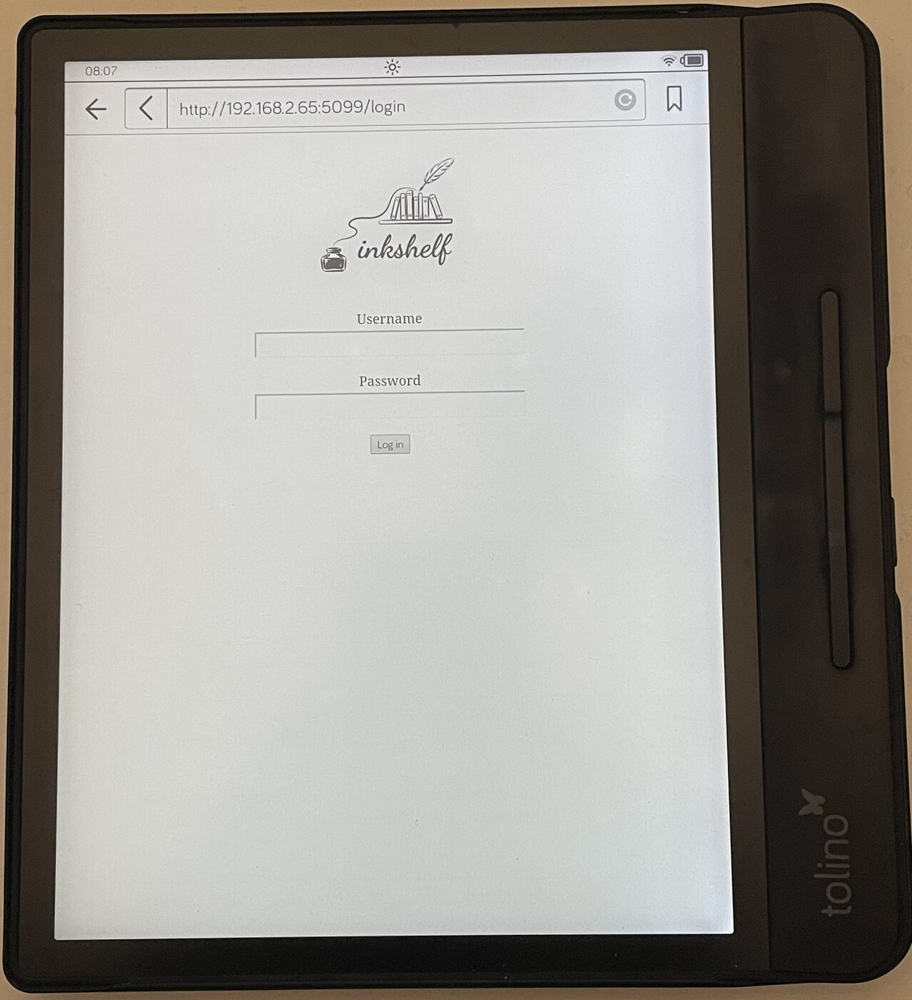
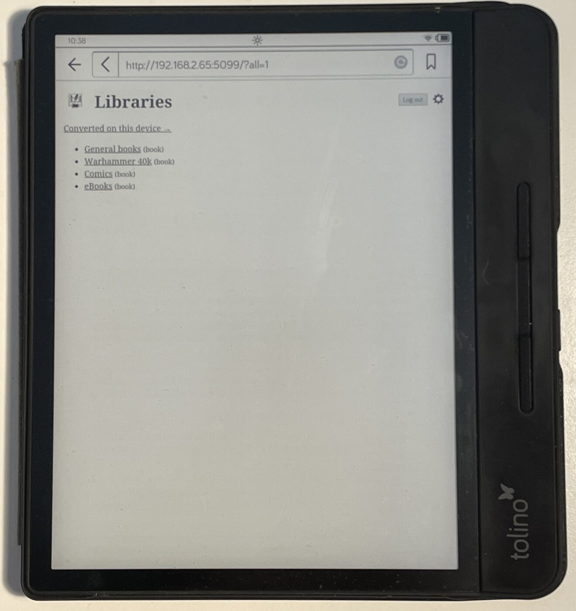
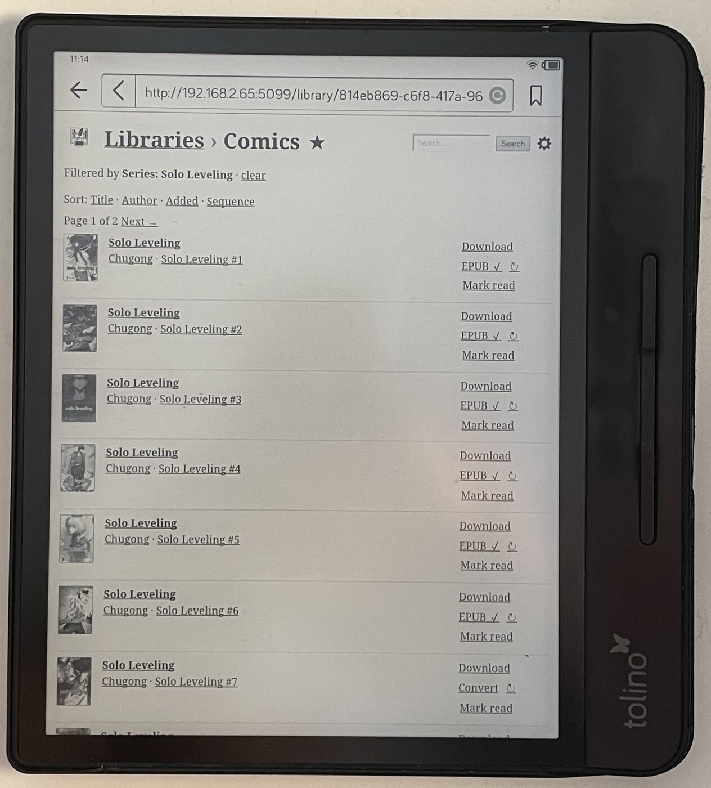
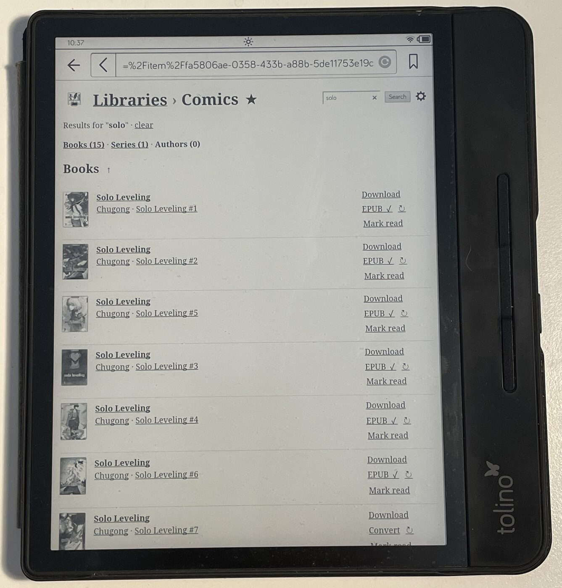
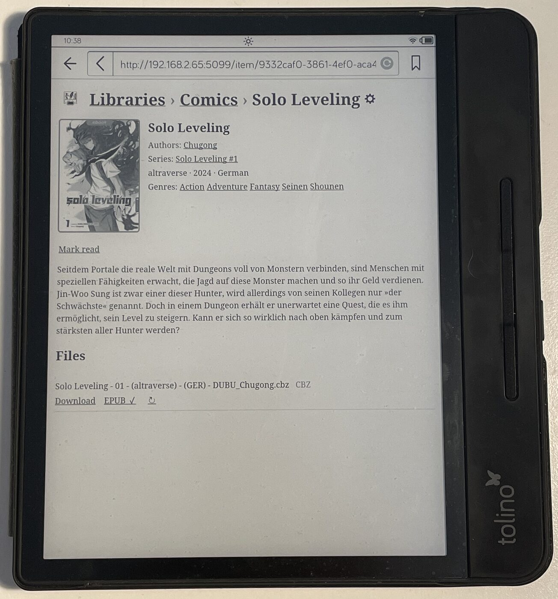
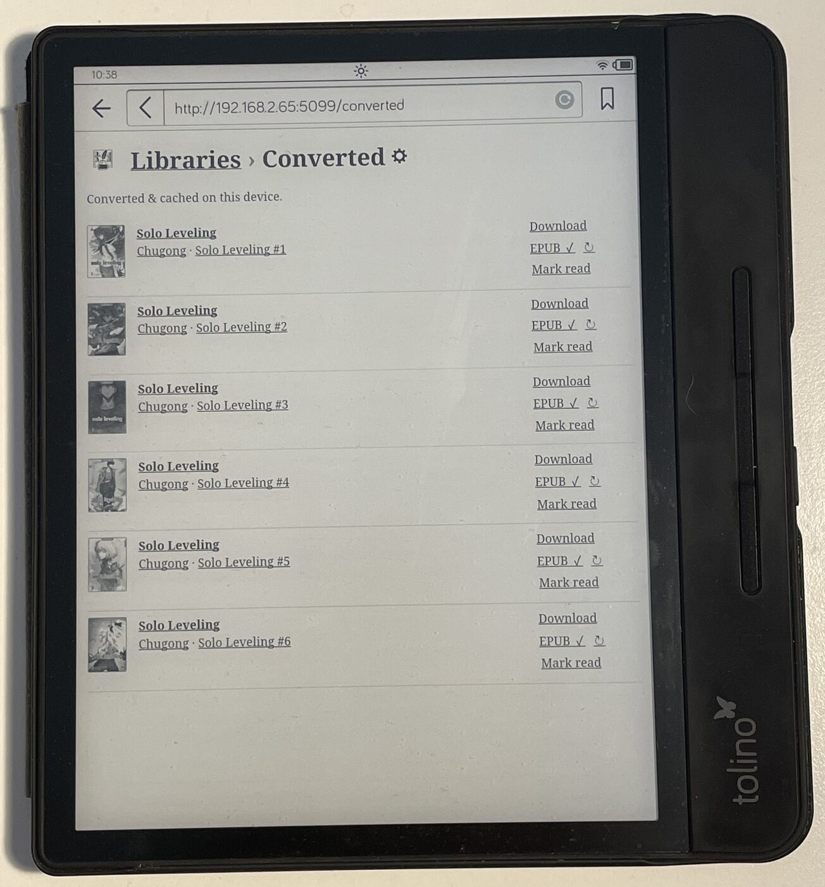
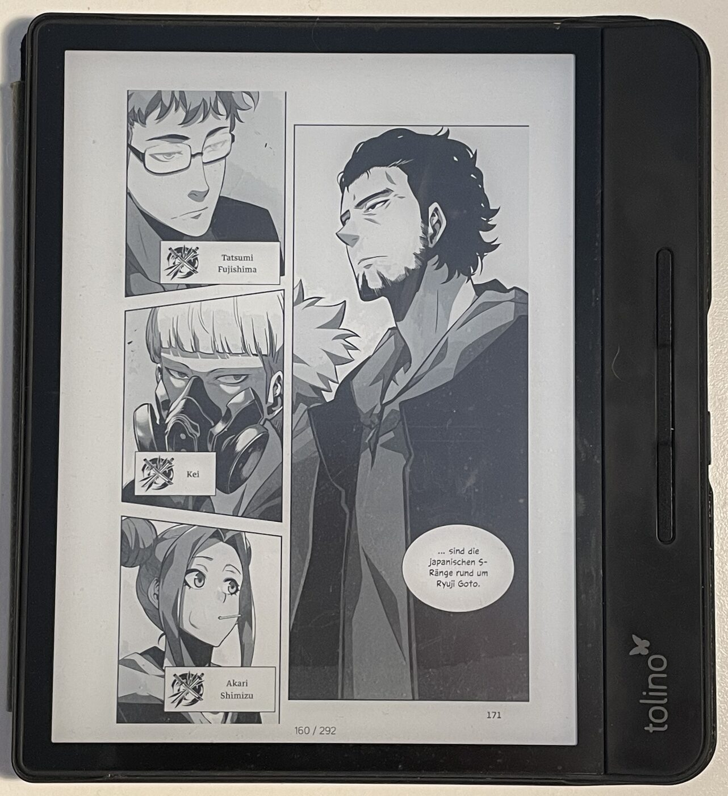

# Screenshots

Inkshelf running on a real e-ink reader. Click any image to enlarge.

### Login

  

Sign in with your Audiobookshelf credentials.

### Libraries

  

The library list, with a link to everything converted on this device.

### Library listing

  

A listing filtered by series — the filter banner (with <em>clear</em>), cycling sort links (incl. Sequence), the prev/next pager, and per-row download / convert / read actions.

### Search

  

Full-text search, grouped into books / series / authors, with the same per-row actions.

### Item detail

  

Full metadata — author, series, genres (all filter links), description — and every downloadable ebook file, each with its own download and, for comics, a convert action.

### Converted on this device

  

Everything already converted and cached for this device, across all libraries.

### Reading a converted comic

  

A CBZ converted to a fixed-layout EPUB, read in the device's native reader.

